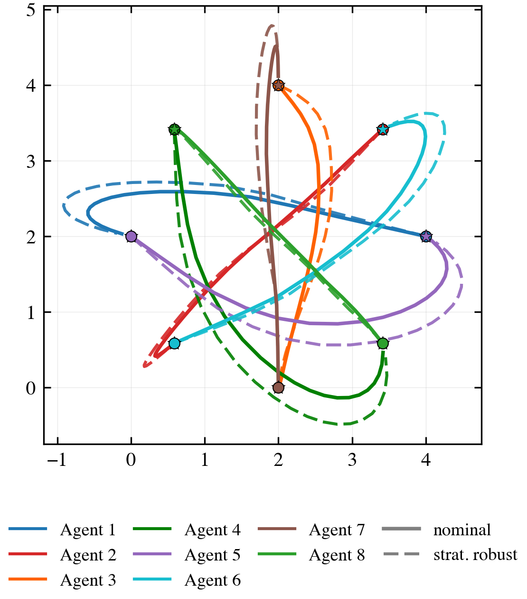

# Strategically Robust Potential Trajectory Optimization

Reference implementation for multi-agent trajectory optimization in which each
agent's collision cost is evaluated against a **worst-case adversarial
perturbation** of the others — at every step of the horizon, not just at the end.

<p align="center">
  
</p>

The claim the code supports: strategic robustness is not the same as turning up
the collision penalty. Both buy separation, but they buy different separation, in
different places, at different cost to the plan.

## Results

Three methods on the paper's scenarios, at disturbance budget `eps = 2`. The
collision weight is `c1 = 2` except for **wider**, which is the same solver at
`c1 = 5` — the naive way to buy margin. Path deviation is the area between a
method's trajectory and the nominal one, averaged over agents.

**Head-on, 2 agents.** Wider buys more absolute worst-case margin, and pays more
than twice the distortion for it.

| method | min separation | min separation, worst case | path deviation |
|---|---|---|---|
| nominal | 0.706 | 0.258 | — |
| wider | 1.162 | **0.762** | 0.516 |
| strategically robust | 0.965 | 0.529 | **0.252** |

**Four agents.** With six interacting pairs the ordering reverses, and
robustness wins on both axes at once — a larger worst-case margin for less than
half the distortion.

| method | min separation | min separation, worst case | path deviation |
|---|---|---|---|
| nominal | 0.965 | 0.147 | — |
| wider | 1.115 | 0.221 | 0.953 |
| strategically robust | 1.075 | **0.279** | **0.405** |

A wider penalty pushes every pair apart uniformly, including pairs that were
never in danger; the robust solve spends its distortion where the adversary would
actually attack. Note that on *mean* worst-case separation wider still looks
better at four agents — averaging over six pairs lets slack in five cover a tight
sixth. `notebooks/collision_example.ipynb` shows both statistics side by side.

**Eight agents**, antipodal swap on a circle — 28 pairs, all conflicting at once.
This is where the gap is widest: the nominal plan leaves the tightest pair 0.023
apart under the worst case, effectively a contact, and the robust plan holds
0.186.

| method | min separation | min separation, worst case | path deviation |
|---|---|---|---|
| nominal | 0.432 | 0.023 | — |
| strategically robust | 0.469 | **0.186** — 8.2x | 0.421 |

### Runtime

Median over 5 runs (3 at eight agents); CV ≤ 1.1% on every cell, and every cell's
runs converged to a single optimum. The robust timing **includes its own nominal
initialization**, so the ratio is the end-to-end cost of switching methods, not
the marginal cost of the robust solve.

| scenario | agents | nominal | wider | strategically robust |
|---|---|---|---|---|
| Head-on | 2 | 0.210 s | 0.237 s (1.13x) | 0.307 s (**1.46x**) |
| Parallel | 2 | 0.061 s | 0.087 s (1.43x) | 0.101 s (**1.67x**) |
| 4 agents | 4 | 0.897 s | 1.062 s (1.18x) | 1.721 s (**1.92x**) |
| 8 agents | 8 | 42.43 s | 27.29 s (0.64x) | 52.39 s (**1.23x**) |

Two things in that table are worth not glossing over. The robust overhead
*shrinks* as the problem grows — 1.92x at four agents, 1.23x at eight — and the
reason is not that the adversary gets cheaper. Measured per SLSQP iteration, a
robust step costs the same as a nominal one (1.0–1.1x), and the Appendix-B
precompute is 0.2 ms at every scale. The ratio is almost exactly
`1 + robust_iterations / nominal_iterations`, so it is high wherever the
*nominal* problem is easy: parallel needs 9 nominal iterations against the
robust solve's 6, while eight agents needs 131 against 32.

And at eight agents the wider penalty is **faster than nominal** (0.64x): the
stronger barrier conditions the problem better, converging in 85 iterations
against 131.

### Single shooting

Solving over the controls alone eliminates every equality constraint — 336 of
them at eight agents — and roughly halves the variable count:

| solve | full space | single shooting | |
|---|---|---|---|
| nominal, 8 agents | 42.00 s | 2.10 s | 20.0x |
| strategically robust, 8 agents | 10.21 s | 0.94 s | 10.9x |

The two parameterizations start from different points and reach different local
minima here (nominal objective 48.36 full-space against 36.69 shooting — shooting
found the better one), so compare the objectives alongside the times.

Shooting also changes what the robust *ratio* measures. In the full space, 96–100%
of every SLSQP iteration is the constrained QP — a cost both methods pay
identically — which hides the robust objective and gradient evaluation entirely
(1.67 ms against 0.14 ms, inside a 42 ms iteration). Removing 336 constraints
collapses the QP, and the evaluation becomes ~47% of a robust iteration. The
robust ratio therefore *rises* under shooting even though both methods get ~10x
faster in absolute terms: at four agents, 1.92x full-space against 1.93x
shooting, and at two agents 1.67x against 2.02x on the parallel scenario. The
full-space ratios are flattered by a large shared constant.

## Layout

| File | Contents |
|---|---|
| `costs.py` | Inter-agent distance costs, each paired with its analytic derivative. |
| `adversary.py` | The worst-case oracle: selected-state closed form, Newton solve for the multiplier, numba kernel. numpy and numba only. |
| `solvers.py` | The four solver entry points — nominal / robust, full-space / single-shooting. |
| `plotting.py` | Publication figures and trajectory animations. Nothing else imports it. |
| `plot_style.py` | Two-column conference style and palette. |
| `benchmark_tables.py` | Runtime and path-deviation tables. Runs headless. |
| `notebooks/collision_example.ipynb` | The worked example: 2, 4 and 8 agents, every figure and table. |
| `notebooks/collision_example.py` | Cell source for the above in `# %%` format — the file of record, since it reviews as a normal diff. `notebooks/build.py` regenerates the notebook from it. |

The solver imports only numpy, scipy and numba: `benchmark_tables.py` runs on a
headless box with no plotting stack installed.

## Install

```bash
python -m venv .venv && source .venv/bin/activate
pip install -r requirements.txt                  # solver + benchmarks
pip install -r requirements-notebook.txt         # figures + notebook
```

Python 3.10–3.12. numba 0.63 has no wheels past 3.12, and its kernel is on the
hot path.

## Reproduce

```bash
python benchmark_tables.py --runs 30                    # the tables above
python benchmark_tables.py --runs 30 --shooting         # single-shooting variant
python benchmark_tables.py --scenarios "8 agents" --runs 10
python notebooks/build.py --execute                     # every figure, from source
jupyter lab notebooks/collision_example.ipynb
```

## A note on gradients

Every solver takes an optional `distance_cost_grad_func`, and every caller here
supplies one. This is not only a speed question. Without it SLSQP finite-
differences the objective (~100x the function evaluations) *and* tends to stop
early on a worse optimum — comparing a robust solve against such a baseline
inflated the measured 8-agent overhead from 1.29x to 3.72x. `costs.make_cost`
returns the cost and its derivative together so the pair cannot be separated by
accident.

The paper derives the adversary's closed form (Appendix B) but not the gradient
of the outer objective, which is the part that is easy to get wrong. That
derivation is below.

## License

MIT. See `LICENSE`.

---

## Appendix: the outer gradient

The paper gives the adversary's closed form in Appendix B, but not the gradient
of the outer objective — the quantity SLSQP actually consumes. Section IV says
only *"we provide the function and its gradient."* That gap is where the trap is,
so the derivation is recorded here.

### The inner problem

For a pair $(i,j)$ and prefix length $N$, the adversary perturbs the relative dynamics with energy budget $\varepsilon$ to close the distance at step $N$. Write $z_N = x_{i,N} - x_{j,N}$ for the relative state, $G_N = \sum_{l<N} A^l B B^\top (A^\top)^l$ for the reachability Gramian, and $C$ for the selection matrix picking the collision-relevant components. Then

$$
C z^{\mathrm{worst}}_N = C z_N - \Gamma_N \left( \Gamma_N + \lambda_N I \right)^{-1} C z_N,
\qquad \Gamma_N = C G_N C^\top,
$$

with $\lambda_N \ge 0$ fixed by the secular equation

$$
\sum_l \frac{\sigma_l w_l^2}{(\lambda_N + \sigma_l)^2} = \varepsilon^2,
$$

where $\sigma_l$ are the eigenvalues of $\Gamma_N$ and $w$ holds the coordinates of $C z_N$ in its eigenbasis. A root $\lambda_N > 0$ exists iff $\sum_l w_l^2 / \sigma_l > \varepsilon^2$; otherwise $\lambda_N = 0$ and the adversary reaches contact exactly. Implemented in `adversary.compute_selected_worst`.

### Why the gradient does not differentiate through it

The robust collision cost for that pair and prefix is $f(\lVert C z^{\mathrm{worst}}_N \rVert)$, and $z^{\mathrm{worst}}_N$ depends on $z_N$ through the inner optimization. It looks as though differentiating requires pushing through the whole recursion. It does not.

At the optimal $\lambda_N$ the adversary's controls $\delta u^\star$ solve the inner problem, so they are stationary and may be **held fixed** when differentiating the outer objective — the envelope theorem. Held fixed:

- $\delta z_N$ is determined entirely by propagating $\delta u^\star$ through the dynamics,
- so $\delta z_N$ does not depend on $z_N$,
- so $\mathrm{d} z^{\mathrm{worst}}_N / \mathrm{d} z_N = I$.

The gradient is therefore the *same formula as the nominal case*, evaluated at the worst-case position rather than the planned one. With $d_{\mathrm{worst}} = \lVert C z^{\mathrm{worst}}_N \rVert$,

$$
\frac{\partial f}{\partial x_{i,N}} = + f'(d_{\mathrm{worst}}) \frac{C z^{\mathrm{worst}}_N}{d_{\mathrm{worst}}},
\qquad
\frac{\partial f}{\partial x_{j,N}} = - f'(d_{\mathrm{worst}}) \frac{C z^{\mathrm{worst}}_N}{d_{\mathrm{worst}}}.
$$

`solvers._make_everystep_costs` writes the pullback as `C.T @ (...)`, which for $C = [I_p \ \ 0]$ fills the position components and stays correct for a weighted $C$.

### The pitfall

An earlier derivation used $\mathrm{d} z^{\mathrm{worst}}_N / \mathrm{d} z_N = I + P_N$, where $P_N$ is the Jacobian of the recursion mapping $z_N$ to $\delta z_N$ — unrelated to the eigenvectors above. That is the **total** derivative: it accounts for $\delta u^\star$ moving as $z_N$ moves. The envelope theorem calls for the **partial** derivative at fixed $\delta u^\star$, which is $I$.

The difference is not subtle. Against finite differences the $I + P_N$ gradient was wrong by order 10; the corrected one agrees to $\sim 10^{-7}$.

### Verification

Both gradients were checked against `scipy.optimize.approx_fprime` at the
converged solution. Effect on the 2-agent head-on scenario:

| solver | finite difference | analytic gradient |
|---|---|---|
| nominal | 4963 function evals | **47** |
| strategically robust | 6123 function evals | **23** |

Both modes reach the same objective on this scenario (73.3080 and 116.4260). On
the larger ones they do not — which is why `benchmark_tables.py` insists on
analytic gradients for every method it times.

### Constraint Jacobian

Not currently supplied, but the saving is real and the derivation is short. The
dynamics constraints are linear in $z$, so their Jacobian is constant:

$$
\frac{\partial c_{\mathrm{IC}}}{\partial x_{i,0}} = I,
\qquad \frac{\partial c_{\mathrm{dyn}}}{\partial x_{i,t+1}} = I,
\qquad \frac{\partial c_{\mathrm{dyn}}}{\partial x_{i,t}} = -A,
\qquad \frac{\partial c_{\mathrm{dyn}}}{\partial u_{i,t}} = -B,
$$

and zero elsewhere — block-diagonal per agent, since agents are dynamically
independent and couple only through the objective. `_dynamics_constraint` passes
`fun` alone, so SLSQP finite-differences this at every iteration. The
single-shooting solvers sidestep the question entirely: rolling the dynamics
forward removes these constraints rather than differentiating them.
